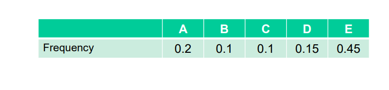

## Shannon-Fano algorithm

- **Step 1:** Sort the table in descending order.
  | E    | A   | D    | B   | C   |
  | ---- | --- | ---- | --- | --- |
  | 0.45 | 0.2 | 0.15 | 0.1 | 0.1 |
- **Step 2:** Partition into E(0.45) and ADBC(0.55). Assign `0` to E(0.45) and `1` to ADBC(0.55)
- **Step 3:** Partition ADBC(0.55) into AD(0.35) and BC(0.2). Append `0` to AD(10) and `1` BC(11)
- **Step 4:** Partition AD(10) into A(0.2) and D(0.15). Append `0` to A(100) and `1` to D(101)
- **Step 5:** Partition BC(11) into B(0.1) and C(0.1). Append `0` to B(110) and `1` to C(111)

### Code table
| Symbol | Frequency | Bit Length | Probability | Expected Length |
| ------ | --------- | ---------- | ----------- | --------------- |
| E      | 0.45      | 1          | 0.45        | 0.45            |
| A      | 0.2       | 3          | 0.2         | 0.6             |
| D      | 0.15      | 3          | 0.15        | 0.45            |
| B      | 0.1       | 3          | 0.1         | 0.3             |
| C      | 0.1       | 3          | 0.1         | 0.3             |

Expected Length = 2.1 bits/symbol

## Huffman Algorithm

- **Step 1:** Sort in ascending order
| B   | C   | D    | A   | E    |
| --- | --- | ---- | --- | ---- |
| 0.1 | 0.1 | 0.15 | 0.2 | 0.45 |
- **Step 2:** Initialize minimum heap. [0.1(B), 0.1(C), 0.15(D), 0.2(A), 0.45(E)]
- **Step 3:** Get two minimum elements from heap. [0.1, 0.1]. Sum frequency is 0.2. Add 0.2 into heap. [0.15(D), 0.2(A), 0.2(BC), 0.45(E)]
- **Step 4:** Get two minimum elements from heap. [0.15, 0.2]. Sum frequency is 0.35. Add 0.35 into heap [0.2(BC), 0.35(DA) 0.45(E)]
- **Step 5:** Get two minimum elements from heap. [0.2, 0.35]. Sum frequency is 0.55. Add 0.55 into heap [0.55(BCDA), 0.45(E)].
- **Step 6:** Sum two final frequency [0.55, 0.45]. Sum frequency is 1. Add into heap. [1(BCDAE)] 
- **Step 7:** Assign bit. 
| B   | C   | D   | A   | E   |
| --- | --- | --- | --- | --- |
| 100 | 101 | 110 | 111 | 0   |

### Code table
