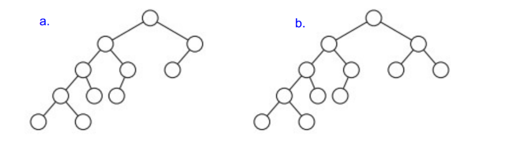
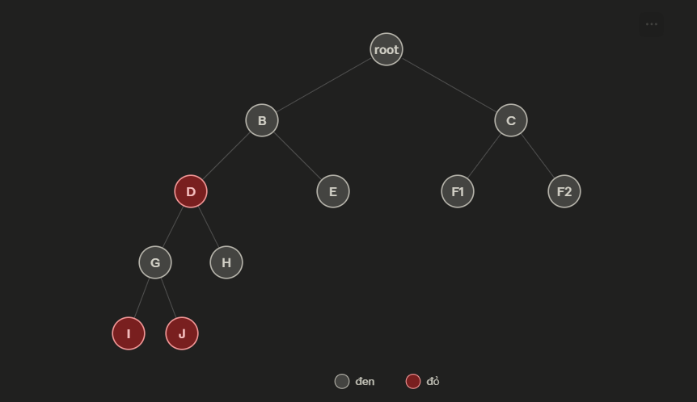

## Step 1 — Determine the "shortest path" and "longest path" from the root to the leaves:
Shortest path in both trees: from the root → down 2 steps → to a leaf.

Longest path in both trees: from the root → down 4 steps → to a leaf.

 "Đây là điểm mấu chốt của Red-Black Tree: tính chất 5 (black-height) buộc mọi đường đi từ gốc đến lá phải có cùng số node đen. Mà tính chất 4 (không có 2 node đỏ liên tiếp) giới hạn: node đỏ chỉ có thể "chen" giữa các node đen, không được đứng cạnh nhau. Nên nếu 1 đường đi dài gấp đôi đường ngắn nhất, cây may ra vẫn hợp lệ được — đây chính là trường hợp biên (ranh giới), cần kiểm tra kỹ chứ không suy diễn cảm tính."

## Step 2 — Check tree a: node C has exactly one child (F):
Applying Property 2, the root is always colored black.

When a node has only one actual child (with the other being NIL), Property 5 dictates the following:
+ The path C → NIL (the empty child) and the path C → F → NIL must contain the same number of black nodes starting from C downwards.
+ The path leading directly to NIL has zero black nodes in between. Therefore, the path through F must also have zero black nodes in between, meaning F must be RED.
+ Since F is red, its parent—C—must be BLACK (Property 4: a red node cannot have a red parent).

$\Rightarrow$Thus: root (black) → C (black) → F (red) → total number of black nodes on this path = 2.

## Step 3 — Apply that same "black number" (2) to the longest branch:

The longest path — root → B → D → G → I — contains 5 nodes and must therefore include a total of 2 black nodes. Since the root already accounts for one, only a single black node remains to be distributed among the other four nodes (B, D, G, I), which are arranged in a continuous parent-child chain.

However, for a linear chain of four nodes, avoiding two consecutive red nodes requires a minimum of two black nodes (arranged in an alternating black-red-black-red pattern). A single black node is insufficient; regardless of where it is placed among the four positions, there will inevitably be at least two red nodes adjacent to each other somewhere in the sequence.

$\Rightarrow$Contradiction. Therefore, tree 'a' cannot be colored as a valid Red-Black Tree, no matter what method you try.

## Step 4 — Check Tree b: node C has two children (F1, F2):

Since node C no longer has any empty (NIL) children—meaning there are no longer the forced constraints present in tree (a)—there is more freedom to achieve balance. I found a valid coloring:

+ root → tree root
+ B → left child of root, C → right child of root
+ D, E → two children of B; F1, F2 → two children of C
+ G, H → two children of D
+ I, J → two children of G (the two leftmost, deepest leaf nodes)

We have: Root, B, C, E, H, and G are black; D, I, and J are red (left subtree, maintaining black-height=3); and in the right subtree, C → F1 and F2 (both leaves are black). Verification: no two red nodes are adjacent, and every path from the root to a leaf contains exactly three black nodes—fully satisfying the five Red-Black Tree properties.

## Conclusion:
Tree a - couldn't be a Red-Black Tree because:

The root's right child has only one actual child (the other branch is NIL). Based on the black-height property, this child must be red, which implies its parent (the root's right child) must be black. Consequently, the black-height of the entire tree can only be 2. However, the tree's deepest left branch contains four nodes in a consecutive parent-child chain (excluding the root); maintaining a black-height of 2 allows for at most one black node among these four, which inevitably results in at least two adjacent red nodes somewhere in the chain—violating the "no two consecutive red nodes" property. Therefore, no valid coloring exists.

Tree b — could be a Red-Black tree.

