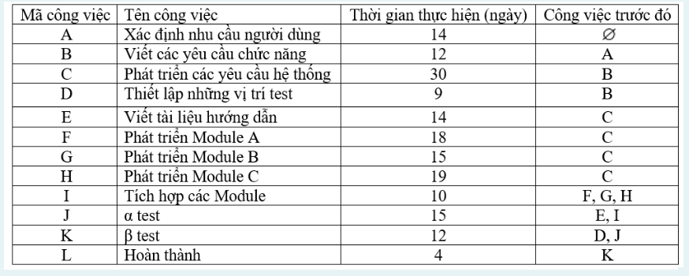
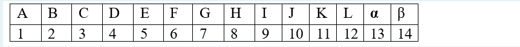
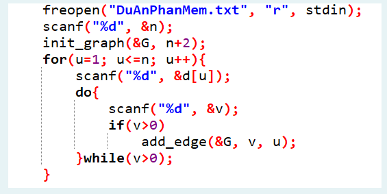

Việc thực hiện một dự án phát triển phần mềm được bố trí thành các công việc và thời gian thực hiện như sau:



- Anh Tuấn là một thành viên trong nhóm phát triển phần mềm. Anh ta thường hay hỏi mọi thành viên trong nhóm các câu hỏi tương tự như sau: "Nếu công việc E mình bắt đầu làm vào ngày thứ 60 thì tổng thời gian thực hiện dự án có bị ảnh hưởng không?" "Nếu công việc H mình bắt đầu làm vào ngày thứ 50 thì tổng thời gian thực hiện dự án có bị ảnh hưởng không?". Anh ta hỏi mọi người hoài những câu hỏi tương tự như thế làm cho các thành viên trong nhóm bực bội. Biết rằng dựa vào bảng công việc người ta có thể xác định thời điểm sớm nhất và trể nhất để bắt đầu cho mỗi công việc mà không ảnh hưởng đến tiến độ của dự án phần mềm. Hãy viết chương trình để giúp anh Tuấn tự trả lời câu hỏi của mình. 

Để đơn giản trong cài đặt, ta đánh số lại các công việc theo thứ tự 1, 2, 3 thay vì A, B, C và lưu vào tập tin theo định dạng như sau:



Đầu vào:
```
12
14 0
12 1 0
30 2 0
9 2 0
14 3 0
18 3 0
15 3 0
19 3 0
10 6 7 8 0
15 5 9 0
12 4 10 0
4 11 0

5 60
```

Dòng đầu tiên là số công việc (12), các dòng tiếp theo mỗi dòng mô tả một công việc bao gồm d[u]: thời gian hoàn thành công việc u và danh sách các công việc trước đó của u. Danh sách được kết thúc bằng số 0. Ví dụ: công việc 1 (công việc A) có d[1] = 14 và danh sách các công việc trước đó rỗng.
Công việc 2 (công việc B) có d[2] = 12 và danh sách công việc trước đó là {1}.
Dòng cuối cùng: công việc u và thời gian bắt đầu t, hai giá trị u và t tương ứng với câu hỏi của anh Tuấn:  "Nếu công việc u mình bắt đầu làm vào ngày thứ t thì tổng thời gian thực hiện dự án có bị ảnh hưởng không?"

Đầu ra:
Yes: Nếu ngày bắt đầu thực hiên công việc nằm trong thời điểm sớm nhất và trể nhất để bắt đầu công việc tương ứng.
No: Nếu ngày bắt đầu thực hiện công việc KHÔNG nằm trong thời điểm sớm nhất và trể nhất để bắt đầu công việc tương ứng.
Ví dụ: Công việc 5, mình có thể bắt đầu làm vào ngày thứ 60 được hay không? => YES (Vì Thời gian sớm nhất và thời gian trể nhất thực hiện công việc 5 là: 56-71, 60 nằm trong khoảng thời gian cho phép)

Chú ý đọc dữ liệu:

