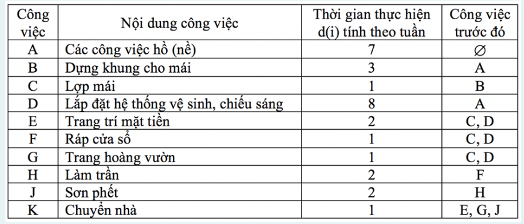
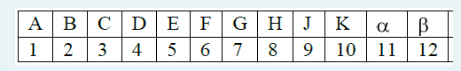
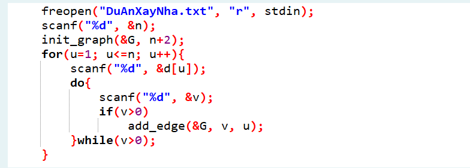

Có một dự án xây nhà với 10 công việc được cho như bảng sau:



Người ta cần:



- Xác định thời điểm sớm nhất và trể nhất để bắt đầu cho mỗi công việc mà không ảnh hưởng đến tiến độ của dự án
Để đơn giản trong cài đặt, ta đánh số lại các công việc theo thứ tự 1, 2, 3 ...thay vì A, B, C....như sau:

Danh sách công việc

 và lưu vào tập tin theo định dạng như bảng giá trị đầu vào

Hãy viết chương trình tìm thời gian sớm nhất hoàn thành dự án và Thời điểm sớm nhất và trể nhất để bắt đầy cho mỗi công việc của dự án mà không ảnh hưởng đến tiến độ của dự án.

Đầu vào:
```
10
7 0
3 1 0
1 2 0
8 1 0
2 3 4 0
1 3 4 0
1 3 4 0
2 6 0
2 8 0
1 5 7 9 0
```
Dòng đầu tiên là số công việc (10), các dòng tiếp theo mỗi dòng mô tả một công việc bao gồm d[u]: thời gian hoàn thành công việc u và danh sách các công việc trước đó của u. Danh sách được kết thúc bằng số 0. Ví dụ: công việc 1 (công việc A) có d[1] = 7 và danh sách các công việc trước đó rỗng.

Công việc 2 (công việc B) có d[2] = 3 và danh sách công việc trước đó là {1}.

Đầu ra:
Dòng đầu tiên: Thời gian sớm nhất hoàn thành dự án
Mỗi dòng tiếp theo: In ra thời gian sớm nhất và thời trể nhất để bắt đầu cho mỗi công việc (1 => n+2, gồm cả công việc alpha và beta)

t(u)-T(u)

Chú ý đọc dữ liệu:

